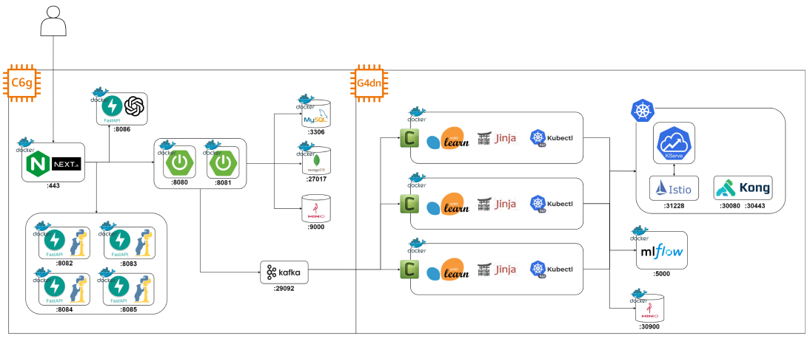
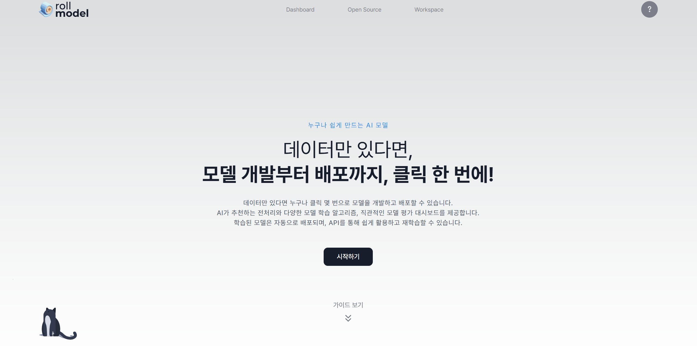
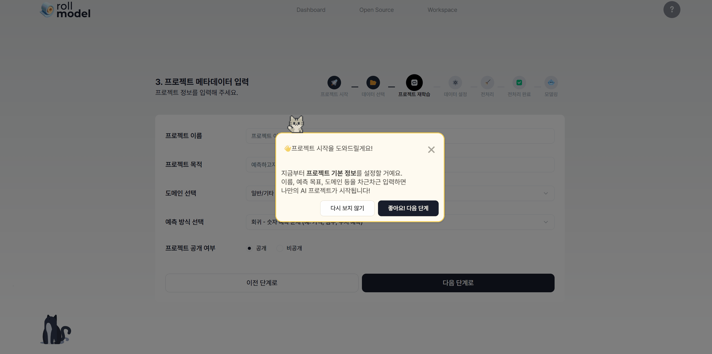
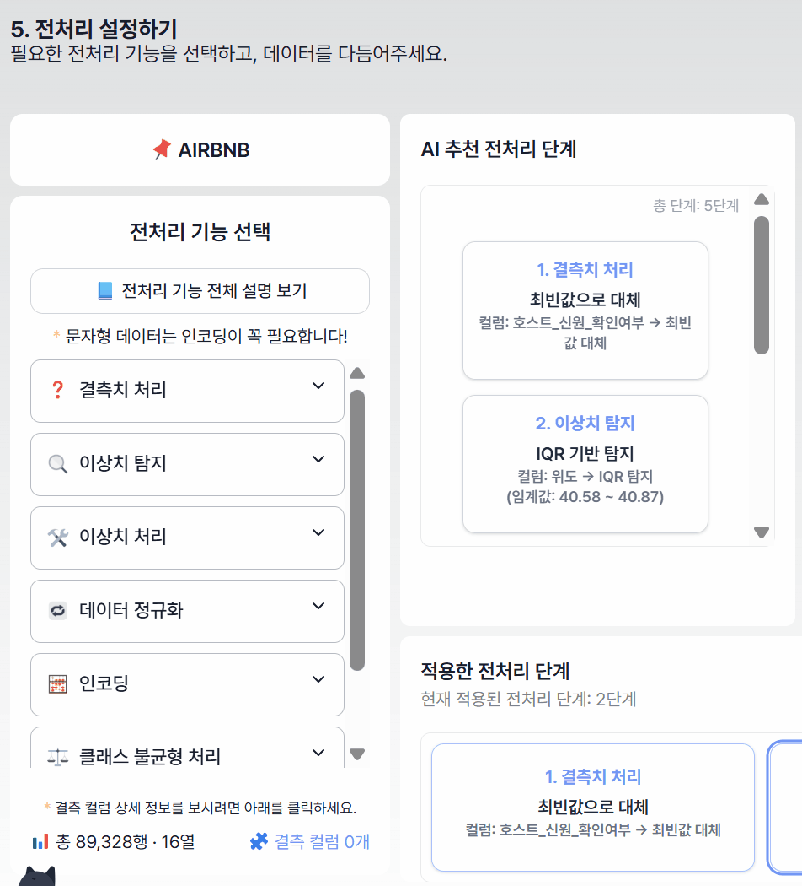
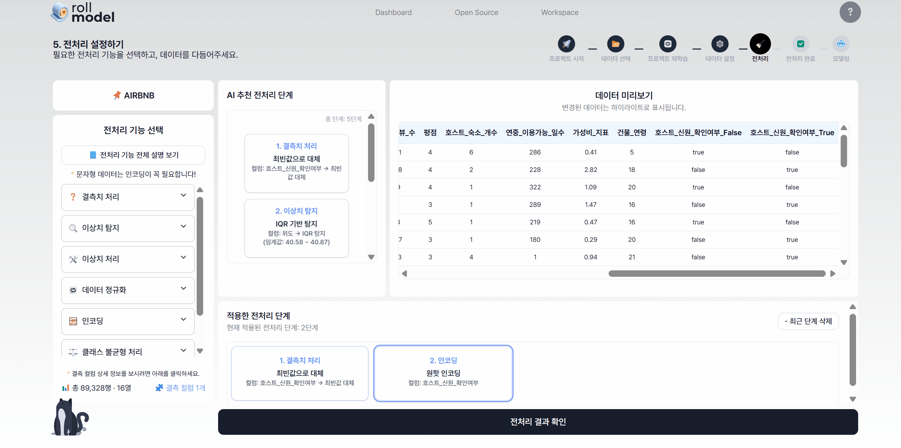
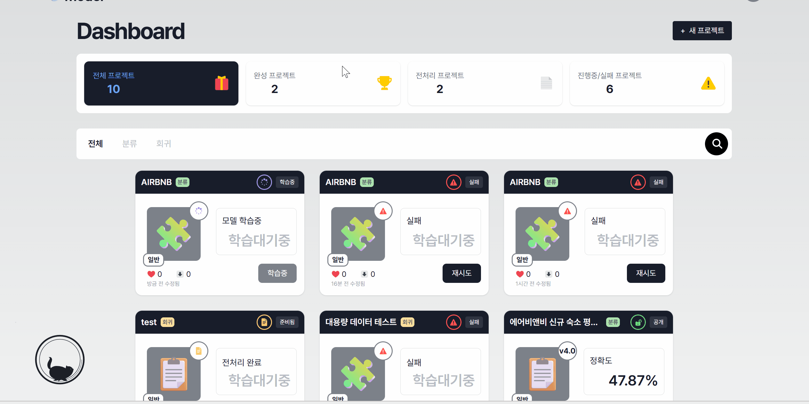
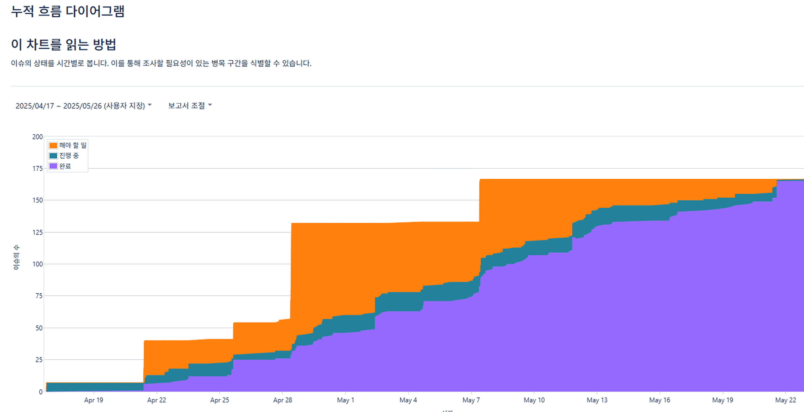

# 🌀 roll-model


**데이터 전처리부터 모델 학습, 배포, API 제공까지 한 번에 말아드립니다.**  
비전문가도 쉽게 사용할 수 있는 노코드 머신러닝 파이프라인 플랫폼 'roll-model' 입니다.


## 🚀 프로젝트 개요

roll-model은 데이터 전처리, 모델링, 평가, 배포 과정의 자동화, 용어와 사용법 가이드를 통해 누구나 손쉽게 AI 모델을 개발하고 API로 배포할 수 있도록 돕는 플랫폼입니다. 

## 📅 개발 기간
**2025.04.14 ~ 2025.05.22 (6주)**


## 목차
- [🌀 roll-model](#-roll-model)
  - [🚀 프로젝트 개요](#-프로젝트-개요)
  - [📅 개발 기간](#-개발-기간)
  - [목차](#목차)
  - [🧩 주요 기능](#-주요-기능)
    - [친절한 가이드라인](#친절한-가이드라인)
    - [✅ 원클릭 데이터 전처리 제공](#-원클릭-데이터-전처리-제공)
    - [🧠 AI 기반 전처리 추천](#-ai-기반-전처리-추천)
    - [🌐 자동 API 배포](#-자동-api-배포)
    - [📌 데이터 인사이트 제공](#-데이터-인사이트-제공)
    - [📊 직관적인 모델 평가 도구](#-직관적인-모델-평가-도구)
    - [🗂️ 버전 관리 시스템](#️-버전-관리-시스템)
    - [♻️ 모델 공유 및 재학습 시스템](#️-모델-공유-및-재학습-시스템)
  - [🏗️ 시스템 아키텍처 및 인프라 특징](#️-시스템-아키텍처-및-인프라-특징)
    - [📦 아키텍처 구조도](#-아키텍처-구조도)
    - [📊 ERD](#-erd)
  - [🧪 기술 스택](#-기술-스택)
  - [📸 스크린 샷](#-스크린-샷)
    - [메인 페이지](#메인-페이지)
    - [워크스페이스](#워크스페이스)
    - [사용자 대시보드 페이지](#사용자-대시보드-페이지)
    - [오픈소스 모델 공유 페이지](#오픈소스-모델-공유-페이지)
    - [모델 상세 페이지](#모델-상세-페이지)
  - [👥 팀 구성](#-팀-구성)
  - [📋 프로젝트 관리 (Jira)](#-프로젝트-관리-jira)
    - [일정 관리 및 스프린트 운영](#일정-관리-및-스프린트-운영)
    - [누적 흐름 다이어그램 (CFD)](#누적-흐름-다이어그램-cfd)
  - [🧭 Git 브랜치 규칙](#-git-브랜치-규칙)
  - [✅ 커밋 메시지 컨벤션](#-커밋-메시지-컨벤션)
  - [🔧 PR 템플릿](#-pr-템플릿)
---

## 🧩 주요 기능

### 친절한 가이드라인
- 튜토리얼 라이브러리를 활용한 사용법 설명
- 가이드라인을 통해 용어 및 세부사항 설명

### ✅ 원클릭 데이터 전처리 제공
- 버튼 클릭으로 전처리 적용
- 전처리 결과 데이터, 전/후 처리 비교 제공

### 🧠 AI 기반 전처리 추천
- 데이터 구조와 프로젝트 목적에 따라 AI 프롬프팅 
- 전처리 과정의 오류 회피 및 모델 학습에 적합한 전처리 추천

### 🌐 자동 API 배포
- 모델 학습 후 API 자동 생성 (Curl, Python, JS, Java 예제 제공)
- 상세 API 문서와 모델 파일 다운로드 옵션 포함

### 📌 데이터 인사이트 제공
- 변수 간 상관관계 분석
- 이상치 감지 및 데이터 분포 분석

### 📊 직관적인 모델 평가 도구
- R², MAE, RMSE 등 다양한 지표 제공
- 특성 중요도 분석 및 예측 결과 시각화

### 🗂️ 버전 관리 시스템
- 모델 버전별 성능/파라미터 이력 추적
- 모델 버전 추적을 통해 연관된 모델 관리

### ♻️ 모델 공유 및 재학습 시스템
- 타 사용자의 모델로 재학습
- 모델 공유 커뮤니티 제공

---

## 🏗️ 시스템 아키텍처 및 인프라 특징

- **메시지 기반 비동기 아키텍처**: Kafka + Celery Worker
- **자동화된 ML 파이프라인**: 학습 요청 → 서빙까지 완전 자동화
- **Kubernetes + KServe 기반 배포**: 오토 스케일링, 자원 격리, 템플릿 배포
- **GPU 자원의 유연한 분할로 효율 증대**: 모델당 약 128MB 메모리로 자원 낭비 최소화
- **Kong API Gateway 기반 보안**: 모델별 ACL 기반 API 키 부여
- **확장 가능한 구조**: 현재는 Scikit-learn 기반, TensorFlow/PyTorch도 확장 가능

### 📦 아키텍처 구조도


### 📊 ERD


---
## 🧪 기술 스택

- **Frontend**: React, FCM, Styled-components
- **Backend**: FastAPI, MongoDB, Celery, Kafka
- **ML Library**: Scikit-learn
- **Infra**: Kubernetes, KServe, Istio, Kong API Gateway, Docker, GitHub Actions (CI/CD)

---

## 📸 스크린 샷

### 메인 페이지

|                                   |
| --------------------------------- |
|  |
| 메인페이지                        |

- 프로젝트 아이덴티티와 기본 가이드 확인가능 
- 구글, 깃허브 소셜로그인

### 워크스페이스

| 데이터 업로드 | 프로젝트 세팅 |
|-----------|-------------------|
|  |  |
| • 1<br>• 2 <br>• 3<br>• 4 | • 1<br>• 2<br>• 3<br> |

| 전처리 가이드  | 전처리 기능 및 AI추천 기능 |
|-----------|-------------------|
|  |  |
| • 1<br>• 2 <br>• 3<br>• 4 | • 1<br>• 2<br>• 3<br> |

| 전처리 파이프라인 추가 | 전처리 파이프라인 삭제 |
|-----------|-------------------|
|  |  |
| • 1<br>• 2 <br>• 3<br>• 4 | • 1<br>• 2<br>• 3<br> |

| 전처리 완료 및 결과 | 모델 파라미터 설정 |
|-----------|-------------------|
|  |  |
| • 1<br>• 2 <br>• 3<br>• 4 | • 1<br>• 2<br>• 3<br> |

### 사용자 대시보드 페이지

|                                   |
| --------------------------------- |
|  |
| 사용자 대시보드 페이지                        |

- 진행중인 프로젝트 확인가능
- 

### 오픈소스 모델 공유 페이지

|                                   |
| --------------------------------- |
|  |
| 오픈소스 모델 공유 페이지                        |

- 
- 

### 모델 상세 페이지

| 전처리데이터 상세 | 학습된 모델 상세 |
|-----------|-------------------|
|  |  |
| • 데이터 요약<br>• 전처리 정보 <br>• 주요 변수 분포<br>• 상관관계 매트릭스 | • 모델 기본 정보<br>• 모델 성능 요약<br>• 모델평가 및 가이드 |

| 재학습 버전관리 상세 | API 서빙 상세 |
|-----------|-------------------|
|  |  |
| • 동일한 데이터 기준 재학습 버전관리 | •학습된 모델 pkl파일 다운로드<br>• API 키 발급<br>• API엔드포인트 URL<br>• 실사용 예제코드 제공 |


---

## 👥 팀 구성

팀명 : **최AI**

|            |  포지션   |                                                                   역할                                                                   |
| :--------: | :-------: | :--------------------------------------------------------------------------------------------------------------------------------------: |
| **임남기** | FE, 팀장  |              오픈소스, 대시보드, 프로젝트 상세(개요, 모델, 데이터, 버전, API), 모델 학습, 학습 상태 FCM 알림, 디자인 디자인              |
| **박가희** |    FE     |             메인, 로그인, 데이터 업로드, 프로젝트 생성, 데이터 전처리, 튜토리얼, 가이드라인, AI 전처리 추천, 재학습, 디자인              |
| **김준석** | BE, Infra |                                           모델 파이프라인(학습/평가/배포/인증/인가), PPT 제작                                            |
| **정규현** | BE, Infra |                     배포, 무중단 처리, CI/CD 파이프라인, 프로젝트 상세 (모델), AI 전처리 추천, 영상 포트폴리오 제작                      |
| **권남희** | BE, 발표  | 오픈소스, 대시보드, 프로젝트 상세(개요, 데이터, 버전, API), 모델 학습, 학습 상태 FCM 알림, 프로젝트 생성, 데이터 업로드,  PPT 제작, 발표 |
| **진우석** |    BE     |                                            인증/인가, 데이터 전처리, 학습 실행, 워크스페이스                                             |

---

## 📋 프로젝트 관리 (Jira)

### 일정 관리 및 스프린트 운영
- **프로젝트 단계별 진행**: 기획 → 기능구현 → 1차 MVP → 2차 MVP → 발표준비 단계로 구분하여 6주간 진행
- **일일 스크럼**: 매일 오전 진행 상황 공유를 위한 스크럼 진행 
- **스프린트 리뷰**: 매주 금요일 완료된 기능 데모 및 회고

### 누적 흐름 다이어그램 (CFD)




## 🧭 Git 브랜치 규칙

```bash
feat/역할(FE/BE/INF)-지라이슈번호-세부기능
```

예시:

```bash
feat/FE-7-login
hotfix/BE-api-error
```

---

## ✅ 커밋 메시지 컨벤션

```bash
[역할] prefix: 세부 기능
```

* feat: 새로운 기능 추가
* fix: 버그 수정
* docs: 문서 수정
* modify: 기능/코드 수정 완료
* refactor: 리팩토링
* hotfix: 긴급 수정
* merge / resolve / remove / add / move / conf / test

예시:

```
[FE] feat: 로그인 화면 구현
[BE] modify: 학습 API 파라미터 변경
```

## 🔧 PR 템플릿

```markdown
# 🤷‍♂️ Description

<!-- 기능을 설명해주세요. -->

# 📸 Screenshots

<!-- 필요한 경우 스크린샷 첨부 -->

# 🔧 Reminder

<!-- 남은 하위 작업을 작성해주세요. -->

# ✳️ Remarks

<!-- 비고란으로 Optional -->
```
